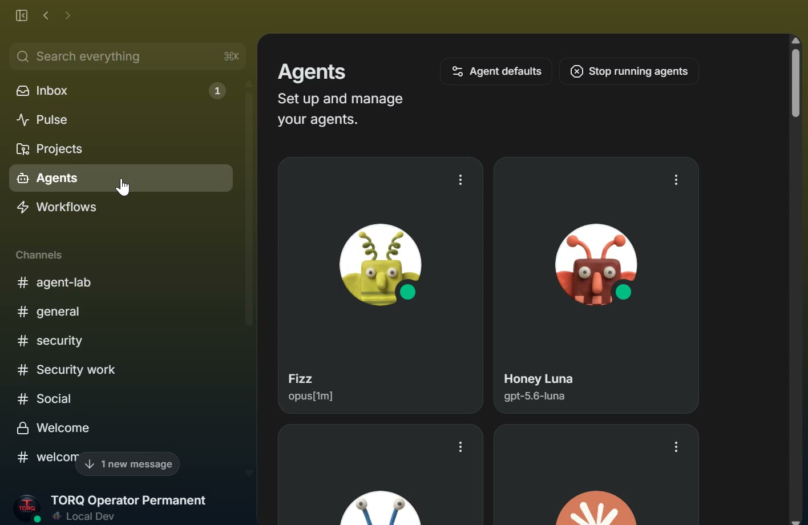

# TORQ Buzz

TORQ Buzz is a Windows-focused operations repository for a local, multi-agent [Buzz](https://github.com/block/buzz) workspace. It combines a pinned [TORQ-maintained Buzz fork](https://github.com/pilotwaffle/buzz), Docker support-service configuration, optional ACP agent harness definitions, and operator runbooks.

This is an operator-oriented source and configuration repository, **not a one-command installer**. Desktop and relay binaries, provider CLIs, credentials, and machine-local runtime data are not bundled here.

## See the running desktop

[](https://github.com/pilotwaffle/Torq-Buzz/raw/refs/heads/main/docs/media/torq-buzz-demo.mp4)

[Watch or download the 20-second demo (MP4)](https://github.com/pilotwaffle/Torq-Buzz/raw/refs/heads/main/docs/media/torq-buzz-demo.mp4).

Recorded from the running Windows desktop on September 5, 2026: the Agents overview, configured model labels, and scrolling through agent cards. This is real UI, not a mockup. It does not demonstrate a completed agent task or certify that the installed binary matches the source pin. The recording has no audio and does not open private conversations.

## What is included

- A Buzz source submodule with desktop, relay, CLI, and agent integration code.
- PowerShell tools for filesystem preparation, harness installation, deployment status, and permanent-relay recovery.
- Docker Compose configuration for PostgreSQL, Redis, and MinIO.
- Six optional ACP harness definitions: Qwen Code, Qwen3.8 Max, DeepSeek v4 Pro, GLM 5.2, GLM 5.3, and Gemini CLI.
- Receipt schemas, migration and rollback procedures, and product/review documents. A PRD or preview flag is not evidence that a feature is enabled in a deployment.

## Source of truth

The checked-in Git submodule entry is authoritative. At this README review, `source/buzz` points to [`fb23b9ea0db5c052063eebbc57415e630ab275ae`](https://github.com/pilotwaffle/buzz/commit/fb23b9ea0db5c052063eebbc57415e630ab275ae) on branch `torq/slice0-on-0.5.23`, based on Block's `desktop-v0.5.23` plus four TORQ commits (Windows portability, loopback health/metrics, inert Slice 0 contracts, path/OAuth/git-sign hardening). [.gitmodules](.gitmodules) selects `pilotwaffle/buzz`, derived from `block/buzz`.

```powershell
git ls-tree HEAD source/buzz
git -C source/buzz rev-parse HEAD
```

Do **not** apply `patches/torq-buzz-local.patch` as a setup step: its changes are already represented in the current fork, and it does not apply cleanly to this pin. The patch is retained as historical material.

`config/installation.json` records the current source pin (`desktop-v0.5.23` / `fb23b9ea0...`) and keeps the older `v0.5.2` / `3e48f1b...` C1 baseline under `c1_pinned_*`. The old `ALL_C1` test still checks that earlier pin and is not a green acceptance gate for the current checkout.

## Getting started on Windows

### 1. Obtain the source

```powershell
git clone --recurse-submodules https://github.com/pilotwaffle/Torq-Buzz.git
cd Torq-Buzz
# For an existing clone without its submodule:
git submodule update --init --recursive
$TorqBuzzRoot = (Get-Location).Path
```

Use Git and PowerShell for the operator scripts, Docker Desktop for the support stack, and the pinned source's [development prerequisites and build instructions](https://github.com/pilotwaffle/buzz/blob/fb23b9ea0db5c052063eebbc57415e630ab275ae/CONTRIBUTING.md) for the app and relay. Building the desktop also requires the Windows native dependencies appropriate to Tauri. Installing a harness does not install or authenticate its provider CLI.

### 2. Prepare the local layout

```powershell
powershell -NoProfile -ExecutionPolicy Bypass -File scripts\Initialize-TorqBuzz.ps1 -Root $TorqBuzzRoot
```

This creates directories and example configuration; it does not install binaries, start Docker, or launch Buzz. Review the templates in [config/](config/) and supply local runtime configuration and secrets separately. Never commit filled-in secret files.

The scripts default to `E:\TORQ-BUZZ`. Pass `-Root` explicitly for a different checkout, and review absolute paths in configuration and scheduled tasks before using them.

### 3. Install optional harness definitions

```powershell
powershell -NoProfile -ExecutionPolicy Bypass -File scripts\Install-CustomHarnesses.ps1 -Root $TorqBuzzRoot
```

This copies harness JSON into the current user's Buzz Desktop app-data directory (`%APPDATA%\xyz.block.buzz.app\custom_harnesses`). Existing files are preserved unless `-Force` is supplied. Configure the corresponding CLI and provider access separately; the model names in these definitions are configuration labels, not a guarantee of provider availability or entitlement.

The DeepSeek definition sets `QWEN_CODE_API_TIMEOUT_MS=600000` (10 minutes). This raises that request timeout; it does not prevent every timeout or provider failure.

### 4. Provision and operate the deployment

Review [the C2-C5 execution plan](docs/C2-C5-EXECUTION-PLAN.md), [Compose configuration](compose/), and [rollback plan](docs/ROLLBACK-PLAN.md) before provisioning services. These operator documents include historical stage gates and machine-specific assumptions; they are not a verified fresh-install wizard.

The operational [Start-PermanentRelay.ps1](scripts/Start-PermanentRelay.ps1) expects a built relay at `bin\buzz-relay.exe`, local `config\relay.env`, and a healthy support stack. By default it adopts an existing relay or invokes the `TORQ-Buzz-PermanentRelay` scheduled task; it does not install that task or start Docker. The older `Start-Buzz.ps1` is a C1 preparation-stage guard, not the live launcher.

After provisioning, inspect the deployment:

```powershell
powershell -NoProfile -ExecutionPolicy Bypass -File scripts\Buzz-Status.ps1 -Root $TorqBuzzRoot
```

The status tool probes services and writes a status evidence file; a clean status report alone does not prove that an agent completed work.

Configured local service addresses (verify against your actual deployment):

| Service | Address |
|---|---|
| Relay WebSocket | `127.0.0.1:3300` |
| Health | `127.0.0.1:8380` |
| Metrics | `127.0.0.1:9302` |
| PostgreSQL | `127.0.0.1:55432` |
| Redis | `127.0.0.1:16379` |
| MinIO API | `127.0.0.1:19000` |
| MinIO console | `127.0.0.1:19001` |

## Managed-agent memory

The pinned ACP implementation enables managed-agent memory by default. For eligible new managed channel sessions with an owner, it attempts to fetch and inject the agent's `core` memory; a missing core prompts an onboarding nudge. This is best-effort: fetch failures or timeouts can skip injection, and edits are not automatically reinjected into an already-running session.

Managed custom harnesses can use the Buzz CLI available in their runtime environment, subject to identity and relay access:

```bash
buzz mem get core
buzz mem set core "Keep durable context concise."
buzz mem ls
buzz mem hash core
# Use the hash returned above and a unified-diff file:
buzz mem patch core --base-hash <hash> --patch-file <diff-file>
```

## Repository layout

| Path | Purpose |
|---|---|
| `compose/` | Support-service configuration |
| `config/` | Templates, ports, and historical installation metadata |
| `crates/` | TORQ helper crates |
| `docs/` | Runbooks, plans, review artifacts, and demo media |
| `harnesses/` | Optional ACP harness definitions |
| `patches/` | Historical patch material; not a current installation step |
| `schemas/` | Receipt and migration schemas |
| `scripts/` | Preparation, validation, status, and recovery tools |
| `source/buzz/` | Pinned TORQ-maintained Buzz fork |

## Verification and limitations

This README was checked against the local tracked files and GitHub repository on September 5, 2026. The review covered the source pin, scripts, harnesses, memory implementation, configuration, and the recorded Agents UI. It was not a clean-machine installation test or a full application test-suite run.

For code changes, follow the pinned source's [test instructions](https://github.com/pilotwaffle/buzz/blob/fb23b9ea0db5c052063eebbc57415e630ab275ae/CONTRIBUTING.md#running-tests), and test the relevant Windows operator scripts separately. Do not use the historical `ALL_C1` result as a substitute for current-source tests. Before publication, review the exact staged files, run `git diff --check`, and use a secret scanner appropriate to the files being published.

## Security and licensing

Runtime directories and local secret-file patterns are excluded by [.gitignore](.gitignore). Ignore rules are not encryption or a guarantee against accidental disclosure. Do not publish private keys, API tokens, runtime env files, logs, or unreviewed screen recordings.

Credential storage and exposure depend on the selected identity and harness. Managed-agent runtimes can pass credentials through process environment variables, so it would be incorrect to claim keys never leave a credential store. Treat agents and subprocesses according to their granted access and protect the host accordingly.

The root repository is [MIT licensed](LICENSE). The Buzz source submodule carries its own [Apache-2.0 license](https://github.com/pilotwaffle/buzz/blob/fb23b9ea0db5c052063eebbc57415e630ab275ae/LICENSE); retain applicable notices when redistributing it.
